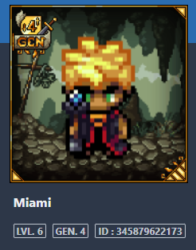
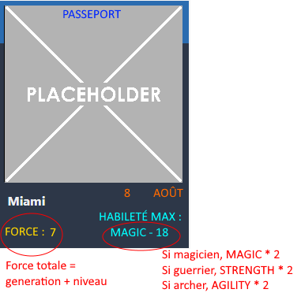

# Causerie : Retour sur DTO et cookie

<Row>

<Column>

:::tip Avant la séance (2h)

Essayez de répondre aux questions suivantes en utilisant ce que vous avez compris de ces concepts

- Qu'est-ce qu'un DTO ?
- Pourquoi on utilise les DTO ?
- Qui utilise les DTO ?

- Qu'est-ce qu'un cookie ?
- Qui crée et qui utilise le cookie ?
- Est-ce que la gestion des cookies est pareille partout ?

:::

</Column>

<Column>

:::info Séance

Nous aurons une discussion pour répondre aux questions ci-contre. Le but est de consolider votre compréhension de ces deux concepts clés de programmation.

- Comment sont gérés les cookies avec springboot security ?
- Qu'est-ce que cela amène comme conséquence avec les sessions d'un usager?
- En quoi est-ce différent ou pareil à la procédure utilisée en .net ?

:::

</Column>

</Row>

:::note Exercice interactif

En équipe de 3 ou 4, étudiez les mises en situation et formulez une solution potentielle au problème.

### Krypt'Eau Raideur

Vous décidez de faire un jeu sur le réseau **Ethereum**. Sur la blockchain, chaque action coûte un montant (appelé **gas**). De 5$ à 50$ par transaction (selon l'achalandage). Nul besoin de vous expliquer à quel point vous souhaitez **réduire le nombre de transactions**. De plus, vous voulez **éviter l'envoi inutile de données** puisque la taille de la transaction augmente également le coût.

Pour jouer, les participants devront se créer un héro. Voici la classe modèle :

```java
public class hero {
	Long id;
	String nom;
	int generation;
	int niveau;
	Date dateNaissance;
	String race; // orc, elfe, humain
	String job; // magicien, archer, guerrier
	int strength;
	int agility;
	int magic;
	Date dateEmbauche;
	String nomPoste; // explorateur, collecteur, mineur
	Float salaire;
	Arme monArme;
	boolean enQuete;
}
```

#### Exercice 1 : Voir le héro

Votre première tâche est de créer le DTO qui permettra d'afficher les informations suivantes. Notez que l'image affichée est aléatoire.



#### Exercice 2 : Transfer vs View Model

On veut maintenant créer une interface afin d'afficher quelques informations intéressantes. Le designer a fait un brouillon.



Votre deuxième tâche est de créer le(s) DTO(s) qui permettra d'afficher les informations ci-dessus. Réfléchissez à qui devrait s'occuper de faire les calculs, quelles informations le client a besoin, etc.

#### Exercice 3 : Écrire sur le blockchain

Lorsqu'un joueur se créer un nouveau personnage, vous effectuez les actions suivantes dans votre code :

1. Créer le hero avec ses informations de base
2. Ajouter une arme au hero (toujours le Wooden Woopa Stick)
3. Envoyer le hero en quête

Comment, avec des DTOs, pouvez-vous réduire au maximum le nombre de transactions ?

### Insta Groom

<Row>

<Column>


</Column>
<Column/>
<Column/>
<Column/>
<Column/>
<Column/>
<Column/>

</Row>

Vous êtes frustré contre le web3 et vous décidez de revenir à ce que vous connaissez : le web 2.0. Vous avez eu une idée de génie : coder un compétiteur à Instagram, mais pour les gens *bien groomés* uniquement.

Voici votre classe de modèle :

```java
public class profilInstaGroom {
	Long id;
	String nomUtilisateur;
	String alias; // @blabla
	String bio;
	boolean estVerifie;
	TypeCompte monCompte; //business, VIP, normal
	Long nombreMedia;
	String photoPrincipaleURL;
	List<profilInstaGroom> jeFollow;
	Feed feedActuel; 
	int scoreGrooming; //ne peut dépasser 9000
}
```

Psst ! Je me suis inspirée du vrai [Instagram](https://developers.facebook.com/docs/instagram-basic-display-api/reference/user) pour le modèle 😉

### Exercice 1 : Boss final

On veut afficher la liste de nos comptes favoris, soit tous ceux qu'on follow. Pour chaque compte, on a son nom d'utilisateur, son alias, sa photo et s'il est vérifié.

Écrivez le(s) DTO(s) qui permettra cet affichage.


:::
